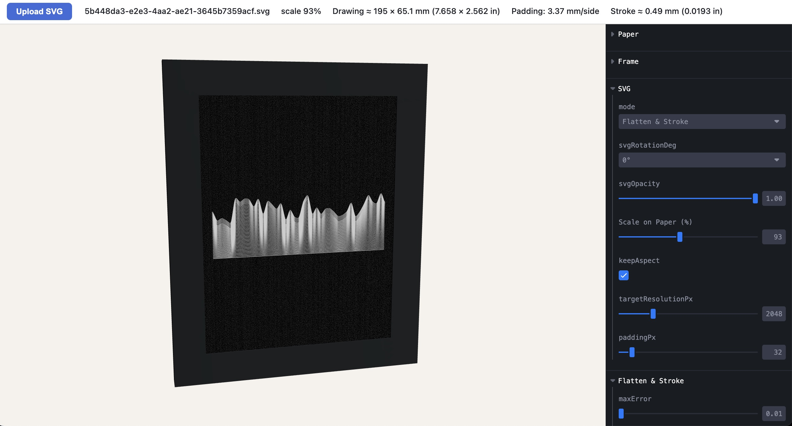
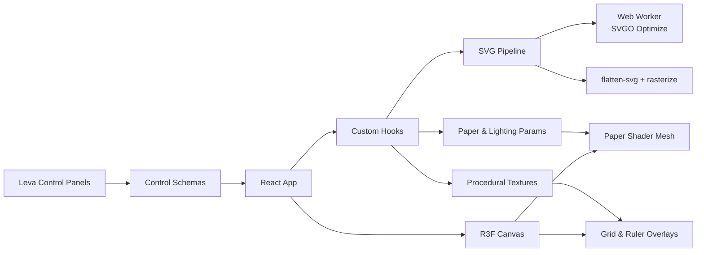

# SVG Paper Preview Tool for pen plotter SVGs

Interactive React + Three.js tool for simulating paper stock, lighting, and SVG artwork before sending to plotters or printers. The app combines a physically-inspired paper shader, real-time controls, and a flexible SVG processing pipeline so designers can tune results and verify scale in a browser.

## UI



## Features

- Realistic paper rendering via a custom fragment shader with procedural grain, fibers, and lighting controls.
- Live SVG imports with two rendering modes: direct rasterization or geometry flattening + stroked outlines.
- Rich control panels (powered by Leva) for paper size/orientation, materials, noise, lighting, grid, and ruler overlays.
- Ruler & grid overlays that respect the chosen unit system to validate scale at a glance.
- Optimized SVG pipeline with background SVGO worker, flatten-svg integration, caching, and raster fallbacks.
- Built on Vite + React 19 + @react-three/fiber for fast hot-module reloading and production builds.

## Getting Started

Prerequisites: Node.js ≥ 18 (LTS recommended) and npm.

```bash
npm install
npm run dev
```

The dev server defaults to `http://localhost:5173`. Use `npm run build` to create a production bundle and `npm run preview` to test the built assets locally.

## Available Scripts

- `npm run dev` – start the Vite dev server with hot reloading.
- `npm run build` – produce an optimized production build in `dist/`.
- `npm run preview` – serve the production build locally for smoke testing.

## Project Structure

```text
src/
  App.jsx                   # Composes the scene, controls, and UI monitors
  components/
    GridOverlay.jsx         # Renders the configurable grid texture plane
    Paper/                  # Paper mesh, shader, and GLSL utilities
    RulerOverlay.jsx        # Canvas-based ruler overlay with unit conversions
  controls/                 # Leva control definitions grouped by domain
  hooks/                    # Scene hooks (SVG texture, paper sizing, overlays)
  utils/
    svg/                    # Flattening, rasterization, optimization helpers
    svgo/                   # SVGO configuration presets
    textures/               # Procedural texture generators for overlays
  workers/
    svgOptimizeWorker.js    # Web worker wrapper around SVGO
public/                     # Static assets served as-is
vite.config.js              # Vite configuration for React + worker entry
```

## Architecture Overview



## Technical Documentation

- **Rendering Layer** (`src/components/Paper`)
  - `Paper.jsx` creates a plane mesh sized to the current paper selection and binds the dynamic uniforms.
  - `PaperShader.js` derives from `@react-three/drei`'s `shaderMaterial` with a custom fragment shader assembled in `shaders/paperFragment.glsl` for noise/fiber blending.
  - Lighting uniforms are driven by Leva controls, allowing ambient/directional color, intensity, and position changes.
- **Control System** (`src/controls/*`)
  - Each module exports a factory that defines Leva control groups (paper, material, noise, fibers, grid, ruler, SVG, flatten, lighting).
  - `App.jsx` memoizes these factories and binds them through `useControls`, ensuring synchronized GUI panels and shader/uniform updates.
- **Hooks & State Management** (`src/hooks`)
  - `usePaperControls` converts Leva state into metric dimensions, plane scale, and rotation angles.
  - `useSvgTexture` orchestrates the SVG lifecycle: file uploads, background optimization, flattening, rasterization, texture generation, and scale metadata.
  - `useGridTexture` and `useRulerOverlay` create canvas-based textures aligned with the current paper scale and unit system.
- **SVG Processing Pipeline** (`src/utils/svg`)
  - `optimize.js` configures SVGO presets and lightweight wrappers.
  - `flatten.js` drives the dual-mode rasterization pipeline, including fallback rasterization, DOM-based stroke extraction, geometric caching, and Path2D fallbacks.
  - `normalize.js` harmonizes SVG units so imported artwork behaves consistently regardless of source DPI.
  - Web worker (`src/workers/svgOptimizeWorker.js`) keeps expensive optimizations off the main thread.
- **Constants & Shared Config** (`src/constants*.js`)
  - Centralized defaults for units, rendering, noise, paper presets, grid/ruler options, and cache limits to keep UI and shader logic aligned.

## Development Tips

- SVG uploads are flattened in the browser; complex files benefit from the `Flatten & Stroke` mode for consistent stroke widths at print scale.
- Path flattening uses browser APIs (`Path2D`, `DOMMatrix`); older browsers fall back to `flatten-svg`, so confirm compatibility if targeting niche environments.
- Large SVGs can take a moment to rasterize; the hook debounces regeneration for smoother UX.
- Use the built-in monitors under the “SVG File” panel to confirm scale in millimeters and inches.

## Troubleshooting

- **Textures appear blank** – Ensure an SVG is selected and the chosen mode matches its complexity; monitor panel should display the current file name.
- **Flat lighting** – Increase directional intensity or adjust light position controls in the Lighting group.
- **Performance dips** – Lower raster resolution, reduce noise octaves, or disable the grid/ruler overlays when tuning materials.

## License

MIT License

Copyright (c) 2025

Permission is hereby granted, free of charge, to any person obtaining a copy
of this software and associated documentation files (the "Software"), to deal
in the Software without restriction, including without limitation the rights
to use, copy, modify, merge, publish, distribute, sublicense, and/or sell
copies of the Software, and to permit persons to whom the Software is
furnished to do so, subject to the following conditions:

The above copyright notice and this permission notice shall be included in all
copies or substantial portions of the Software.

THE SOFTWARE IS PROVIDED "AS IS", WITHOUT WARRANTY OF ANY KIND, EXPRESS OR
IMPLIED, INCLUDING BUT NOT LIMITED TO THE WARRANTIES OF MERCHANTABILITY,
FITNESS FOR A PARTICULAR PURPOSE AND NONINFRINGEMENT. IN NO EVENT SHALL THE
AUTHORS OR COPYRIGHT HOLDERS BE LIABLE FOR ANY CLAIM, DAMAGES OR OTHER
LIABILITY, WHETHER IN AN ACTION OF CONTRACT, TORT OR OTHERWISE, ARISING FROM,
OUT OF OR IN CONNECTION WITH THE SOFTWARE OR THE USE OR OTHER DEALINGS IN THE
SOFTWARE.
